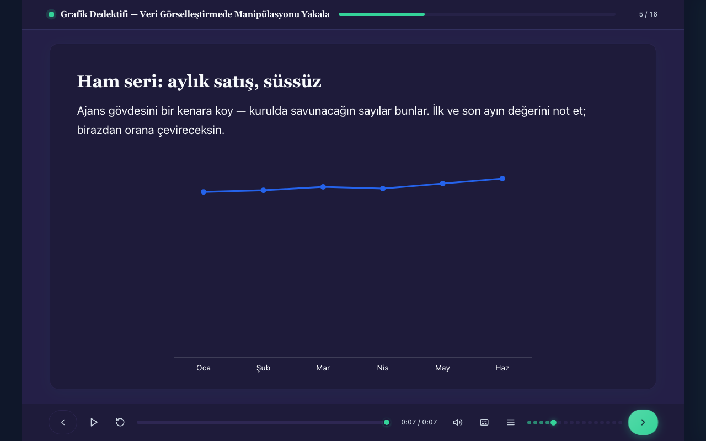

# edumints SCORM MCP

[](LICENSE)
[](https://github.com/kemalyy/edumints-scorm-mcp/releases)
[](pyproject.toml)
[](https://modelcontextprotocol.io)

> **An MCP server that compiles interactive, standards-conformant e-learning courses.**
> You (or an AI client like Claude) are the **author**; this server is the **compiler**.
> Describe a course as a structured spec — the server validates it, renders it, and packages it as a
> **self-contained SCORM zip** that runs in any LMS (Moodle, SCORM Cloud, Rustici Engine, …).
> Deterministic — **no LLM runs on the server**.

**🌐 Languages:** [English](README.md) · [Türkçe](README.tr.md) · [Español](README.es.md) · [Русский](README.ru.md) · [简体中文](README.zh-CN.md) · [Azərbaycanca](README.az.md) · [Қазақша](README.kk.md) · [Кыргызча](README.ky.md)

## Live demos

Four complete courses — four audiences, four visual identities — built entirely with this server
and served from a live deploy. **Click any screenshot to launch.**

| [Be a Password Hero!](https://scorm.edumints.com/demo/password-hero) | [Spot the Phish](https://scorm.edumints.com/demo/spot-the-phish) | [The Ad Hominem Argument](https://scorm.edumints.com/demo/ad-hominem) | [Grafik Dedektifi](https://scorm.edumints.com/demo/grafik-dedektifi) |
|:---:|:---:|:---:|:---:|
| [](https://scorm.edumints.com/demo/password-hero) | [](https://scorm.edumints.com/demo/spot-the-phish) | [](https://scorm.edumints.com/demo/ad-hominem) | [](https://scorm.edumints.com/demo/grafik-dedektifi) |
| Ages 9–13 · internet safety · `style-playful` + custom brand | Corporate onboarding · email security · `style-minimal` + corporate brand | Graduate level · argumentation theory · `style-premium` | Turkish · data literacy · inquiry-based (5E) · evidence-bound assessment |

Each demo features a narrative thread, realistic artifact-mockup SVGs, flag-hunting simulations,
before/after comparisons, timelines, a case game, and adaptive feedback — with question-level SCORM
reporting underneath.

## Why this exists

E-learning is usually hand-crafted in heavy desktop authoring tools. This project treats course
production as **infrastructure for AI agents** instead:

- **Zero-install authoring.** Connect any MCP client to the hosted endpoint and start building —
  no toolchain, no local setup. The client describes the course (objectives, screens, quizzes,
  branching, media) over the [Model Context Protocol](https://modelcontextprotocol.io); the server
  does the hard part: validation, theming, accessible HTML rendering, the SCORM runtime bridge,
  and packaging.
- **A quality gate that says no.** AI can generate a lot of mediocre content fast. This server
  pushes back: schema validation on every spec, an **anti-slop lint** (`lint_course`) whose error
  tier **blocks builds**, and a CI proof chain (XSD + real SCORM Cloud imports + behavioral probe)
  so that what ships actually works in an LMS — see [Standards & evidence](#standards--evidence).
- **No vendor lock-in.** Output is a plain SCORM 1.2/2004 zip with a self-contained player. MIT
  licensed, self-hostable, and open to contributions.

**Author = the MCP client · Compiler = this server.**


## Quickstart

### Option 1 — Hosted MCP (zero install)

Point any MCP client (Claude desktop/web/Code, Antigravity, …) at:

```
https://scorm.edumints.com/mcp
```

Sign in via OAuth or get an API key at the portal: **https://mcp.edumints.com**.
Then ask: *"Build a 6-minute interactive course on X with a quiz and a summary."* — you get a
downloadable SCORM zip back.

> Works best together with the **authoring skill** (a Claude Agent Skill that teaches an AI client
> how to author high-quality courses with this server):
> https://github.com/kemalyy/edumints-scorm-skill

### Option 2 — Docker (self-hosted)

```bash
docker run -p 8000:8000 -v "$PWD/data:/data" ghcr.io/kemalyy/edumints-scorm-mcp:latest
# MCP endpoint: http://localhost:8000/mcp   ·   health: http://localhost:8000/health
```

The image includes all optional features (ffmpeg, Node + HyperFrames for video, Piper TTS).

> **Apple Silicon + Docker Desktop:** if the container crashes with `Illegal instruction` (SIGILL),
> it is an upstream native-ARM64 issue in `cryptography`'s Rust bindings
> ([pyca/cryptography#14733](https://github.com/pyca/cryptography/issues/14733)) — not this repo.
> Workaround: run with `--platform linux/amd64` (emulated).

### Option 3 — Local (Python)

```bash
python -m venv .venv && source .venv/bin/activate
pip install ".[tts]"          # ".[tts]" adds offline Turkish TTS (Piper); drop it if unwanted
python server.py              # serves MCP over HTTP
```

For video generation also install Node 22+ with HyperFrames (`npm i -g hyperframes`) plus ffmpeg.
Configuration: copy `.env.example` and adapt (data dir, quotas, base URL, TTLs). **No secrets are
required** to run locally.

## Example

A course is produced from a single `build_from_spec` call (this is `examples/small.json`, abridged):

```json
{
  "title": "Intro to SCORM",
  "scorm_version": "1.2",
  "language": "en",
  "tracking": { "completion_rule": "viewed_all_and_passed", "passing_score": 50 },
  "screens": [
    { "type": "title_slide", "id": "t1", "title": "Intro to SCORM", "subtitle": "Core concepts in 5 minutes" },
    { "type": "content_slide", "id": "c1", "title": "What is SCORM?", "body_html": "<p><strong>SCORM</strong> lets e-learning content talk to an LMS.</p>" },
    { "type": "mcq", "id": "q1", "title": "Mini quiz", "prompt_html": "<p>What is SCORM for?</p>",
      "options": [
        { "id": "a", "text_html": "Content–LMS communication", "correct": true },
        { "id": "b", "text_html": "Video editing" }
      ], "points": 10 },
    { "type": "summary", "id": "s1", "title": "Well done", "body_html": "<p>You learned the basics.</p>" }
  ]
}
```

```
build_from_spec(spec) → { project_id, screens: 4, warnings: [] }
build_package(project_id) → downloadable SCORM zip
                              ├─ imsmanifest.xml
                              ├─ index.html          (self-contained player + runtime)
                              └─ assets/
```

Full working specs live in [`examples/`](examples/) (games, branching, themed and i18n courses).

## Features

- **30 MCP tools** — `build_from_spec` (single-call path), granular editing
  (`create_project` / `add_screen` / `update_screen` / …), `set_theme` / `set_tracking`,
  `add_asset` (SSRF-guarded imports), `synthesize_speech` (offline Piper TTS), video tools
  (ffmpeg / HyperFrames motion-graphics), `preview` / `validate_package` / `build_package`,
  `lint_course` (quality gate), `export_qti` (QTI 2.1).
- **28 screen types** — title, content, MCQ, true/false, fill-in-the-blank, drag & drop, hotspot,
  branching scenario, video, accordion, tabs, flashcards, matching, sorting, timeline, lottie,
  guided software simulation, decision scenario, term-match race, escape room, labeled diagram,
  data chart, image compare, results breakdown, poll/reflection, summary, **composable game**,
  **adaptive practice**. Full reference: [docs/SCREEN_TYPES.md](docs/SCREEN_TYPES.md).
- **Composable game engine** — the `game` screen composes mechanic primitives
  (score/lives/timer/hints) + declarative `when event if condition then action` rules + branching
  nodes; `adaptive_practice` estimates proficiency (**Elo or Bayesian Knowledge Tracing**) and
  calibrates difficulty per learner. See [docs/GAME-PATTERNS.md](docs/GAME-PATTERNS.md).
- **Slide-stage player** — fixed 16:9 stage scaled to every screen, player bar
  (play/seekbar/captions/menu/replay), narration-synced timed timelines, section-grouped menu,
  fully responsive, inline SVG icons. **i18n shell (tr/en) with RTL support.**
- **Real SCORM tracking** — `cmi.interactions` (question-level reporting), `cmi.objectives`,
  `adlcp:masteryscore` (1.2) / `completionThreshold` (2004), LOM metadata, and a **compact
  suspend-data v2 encoding** for resume state.
- **Theming** — style presets (`style-minimal` / `style-playful` / `style-premium`, and more)
  layered with brand tokens: one style, many brands. Light/neutral/high-contrast presets,
  WCAG-aware, `prefers-reduced-motion` support.
- **Quality gates** — anti-slop lint with a blocking error tier, plus game accessibility audits.
- **Media** — cross-MCP asset import (`add_asset` via data-URI or https), ffmpeg processing,
  programmatic motion-graphic/data-viz video (HyperFrames), built-in offline Turkish TTS (Piper).
- **Telemetry** — optional **xAPI** statements from the player; **cmi5 is partial** (launch
  detection only — no `cmi5.xml` packaging yet). See [docs/GAME-XAPI.md](docs/GAME-XAPI.md).
- **QTI 2.1 export** — quiz screens export as QTI `assessmentItem`s for interop with assessment
  platforms. See [docs/QTI.md](docs/QTI.md).
- **SCORM 1.2 & 2004**, deterministic packaging, cost guardrails, opt-in/lazy heavy features.

## Standards & evidence

Claims are cheap; this repo ships its proof chain in CI:

1. **XSD conformance** — generated `imsmanifest.xml` files are validated against the **official
   ADL/IMS schemas** for both SCORM 1.2 and 2004 (automated in `tests/test_conformance.py`).
2. **Real SCORM Cloud round-trip** — CI imports built packages into actual
   [SCORM Cloud](https://cloud.scorm.com) via its REST API: **4/4 combinations**
   (small/rich × 1.2/2004) must import with **0 parser warnings** and produce a launchable
   registration. This is a **blocking gate**, not an advisory check.
3. **Behavioral probe** — `scorm-probe` launches built courses in **real Chromium against a fake
   LMS** and asserts runtime behavior (init, navigation, scoring, completion). Also blocking in CI;
   a silent skip fails the build.

Details, procedures and honest limits: **[docs/CONFORMANCE.md](docs/CONFORMANCE.md)**.
Accessibility: **WCAG 2.2 AA conformance statement** with explicitly documented limitations —
**[docs/ACCESSIBILITY-CONFORMANCE.md](docs/ACCESSIBILITY-CONFORMANCE.md)**.

## Official sources

The **only** official distribution channels for this project are:

| Channel | URL |
|---|---|
| Source repository | https://github.com/kemalyy/edumints-scorm-mcp |
| Authoring skill | https://github.com/kemalyy/edumints-scorm-skill |
| Container image | `ghcr.io/kemalyy/edumints-scorm-mcp` |
| Hosted MCP endpoint | https://scorm.edumints.com/mcp |
| Account portal | https://mcp.edumints.com |

Anything else — mirror repos, re-uploaded zips, PyPI/npm packages, other registries or domains —
is **unofficial and unverified**. We publish **no** PyPI or npm packages today. If you find a
lookalike, please report it via [SECURITY.md](SECURITY.md).

## Documentation

| Doc | Contents |
|---|---|
| [docs/SCREEN_TYPES.md](docs/SCREEN_TYPES.md) | All 28 screen types with fields and examples |
| [docs/CONFORMANCE.md](docs/CONFORMANCE.md) | SCORM conformance evidence & procedures |
| [docs/ACCESSIBILITY-CONFORMANCE.md](docs/ACCESSIBILITY-CONFORMANCE.md) | WCAG 2.2 AA statement |
| [docs/LMS-INTEGRATION.md](docs/LMS-INTEGRATION.md) | LMS-specific integration notes |
| [docs/QTI.md](docs/QTI.md) | QTI 2.1 export |
| [docs/GAME-PATTERNS.md](docs/GAME-PATTERNS.md) | Game engine patterns |
| [docs/GAME-ADAPTIVE.md](docs/GAME-ADAPTIVE.md) | Adaptive practice (Elo/BKT) |
| [docs/GAME-ANTISLOP.md](docs/GAME-ANTISLOP.md) | Anti-slop quality gate |
| [docs/GAME-XAPI.md](docs/GAME-XAPI.md) | xAPI/cmi5 telemetry |
| [docs/GAME-A11Y.md](docs/GAME-A11Y.md) | Game accessibility |
| [docs/ARCHITECTURE.md](docs/ARCHITECTURE.md) | System architecture |

## Architecture

```
MCP client (author)  ──►  scorm-mcp (compiler)
                            ├─ core/        models (Pydantic), packaging, storage
                            ├─ components/  HTML renderer + runtime engine + video compiler
                            ├─ auth/        API-key + OAuth, SSRF guards
                            ├─ themes/      design tokens / presets
                            ├─ runtime/     vendored SCORM runtime (scorm-again, MIT)
                            └─ server.py    FastMCP tools (HTTP)
```
Output: self-contained `index.html` + `imsmanifest.xml` + assets + SCORM runtime, zipped.

## Contributing

Issues and PRs welcome. The codebase favors small focused modules, additive changes and backward
compatibility. See [CONTRIBUTING.md](CONTRIBUTING.md). Tests: `pytest`.

## License

- This project: **MIT** — [LICENSE](LICENSE).
- Vendored third-party components (scorm-again, lottie-web): [THIRD_PARTY_NOTICES.md](THIRD_PARTY_NOTICES.md).

Built by **[edumints.com](https://edumints.com)**. SCORM is a trademark of ADL; other product names
mentioned are trademarks of their respective owners (nominative use only).
