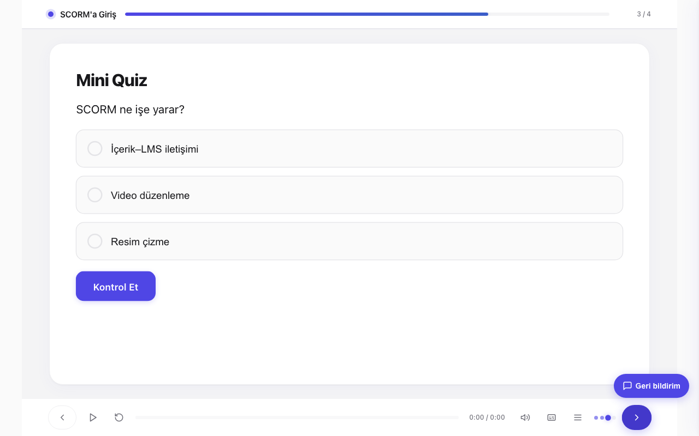

# edumints SCORM MCP

[](LICENSE)
[](https://github.com/kemalyy/edumints-scorm-mcp/releases)
[](pyproject.toml)
[](https://modelcontextprotocol.io)

> **An MCP server that assembles interactive, SCORM-compliant e-learning courses.**
> You (or an AI client like Claude) are the **author**; this server is the **assembler**.
> Describe a course as a structured spec — the server validates, renders, and packages a
> **self-contained SCORM zip** that runs on any LMS (Moodle, SCORM Cloud, …).

**🌐 Languages:** [English](README.md) · [Türkçe](README.tr.md) · [Español](README.es.md) · [Русский](README.ru.md) · [简体中文](README.zh-CN.md) · [Azərbaycanca](README.az.md) · [Қазақша](README.kk.md) · [Кыргызча](README.ky.md)

Open-source, developed by the **[edumints.com](https://edumints.com)** platform. Built to be
**self-hosted** — run it on your own computer or your own server — and **open to contribution**.

---

## The idea (a different approach)

Most e-learning is built by hand in heavyweight desktop tools. Here, an **AI client describes the
course** (objectives, screens, quizzes, branching, media) through the [Model Context Protocol](https://modelcontextprotocol.io),
and the server does the hard part: validation, premium theming, accessible HTML rendering, the SCORM
runtime bridge, and packaging. The result is a standards-compliant SCORM package — no vendor lock-in.

**Author = the MCP client · Assembler = this server.**



## Features

- **28 screen types** — title, content, MCQ, true/false, fill-in-blank, drag & drop, hotspot,
  branching scenario, accordion, tabs, flashcards, matching, sorting, timeline, lottie, **guided
  software simulation**, video, summary, **decision scenario**, **term match race**, **escape room**,
  **labeled diagram**, **data chart**, **image compare**, **results breakdown**, **poll**,
  **composable game**, **adaptive practice**.
- **Composable game engine** — the **`game`** screen composes mechanic primitives (score/lives/timer/
  hints) + declarative `when event if cond then action` rules + branching nodes; the **`adaptive_practice`**
  screen estimates competency (Elo or Bayesian Knowledge Tracing) to calibrate difficulty to the learner.
  Optional **xAPI/cmi5** telemetry, an **anti-slop quality gate** (`lint_course`), and game accessibility
  (WCAG 2.2.1). All deterministic — no server-side LLM. See `docs/GAME-ECD.md`, `docs/GAME-ADAPTIVE.md`.
- **Slide-stage player** — fixed 16:9 stage that scales to any screen, a player bar (play/seek/
  captions/menu/replay), and **timed timeline reveal** synced to narration. Section-grouped outline menu.
  Adjustable stage size; fully responsive/mobile; inline SVG icons (no emoji).
- **Logic & gamification** — variables/state, conditional visibility, branching, points & timer HUD.
- **Assessment** — aligned questions with feedback on correct/incorrect, scoring written to SCORM.
- **Media** — cross-MCP ingestion (bring audio/image/video from your own MCPs → `add_asset`),
  ffmpeg processing, **programmatic motion-graphic/data-viz video** (HyperFrames), and a built-in
  **Turkish TTS** (Piper, offline) for quick narration.
- **Theming & accessibility** — light/neutral/high-contrast presets, brand tokens, WCAG-minded,
  `prefers-reduced-motion` respected.
- **SCORM 1.2 & 2004**, deterministic packaging, cost guardrails, opt-in/lazy heavy features
  (nothing loads unless a course uses it).

## Quickstart (self-hosting)

### Docker (recommended)
```bash
docker run -p 8000:8000 -v "$PWD/data:/data" ghcr.io/kemalyy/edumints-scorm-mcp:latest
# MCP endpoint: http://localhost:8000/mcp   ·   health: http://localhost:8000/health
```

Or build from source:
```bash
git clone https://github.com/kemalyy/edumints-scorm-mcp.git
cd edumints-scorm-mcp
docker build -t edumints-scorm-mcp .
docker run -p 8000:8000 -v "$PWD/data:/data" edumints-scorm-mcp
```
The image includes everything for the optional features (ffmpeg, Node + HyperFrames for video,
Piper + a Turkish voice for TTS).

> **Apple Silicon + Docker Desktop:** if `docker build`/`run` crashes with `Illegal instruction`
> (SIGILL), that's an upstream native-ARM64 issue in the `cryptography` package's Rust bindings
> ([pyca/cryptography#14733](https://github.com/pyca/cryptography/issues/14733)), not this repo.
> Workaround: `docker build --platform linux/amd64 -t edumints-scorm-mcp .` (runs under emulation).

### Local (Python)
```bash
python -m venv .venv && source .venv/bin/activate
pip install ".[tts]"          # ".[tts]" adds the offline Turkish TTS (Piper); omit to skip
python server.py              # serves the MCP over HTTP
```
For video generation, also install Node 22+ and HyperFrames (`npm i -g hyperframes`) + ffmpeg.

### Configuration
Copy `.env.example` and adjust (data dir, quotas, base URL, TTL). See the file for all options.
No secrets are required to run locally.

## Connecting an AI client

Point any MCP client at `http://<your-host>:8000/mcp`:
- **Claude** (desktop/web/Code) — add it as a connector / MCP server.
- **Antigravity** and other MCP clients — same endpoint (HTTP/Streamable).

Then ask: *"Create a 6-minute interactive course about X with a quiz and a summary."* The client
calls the tools below; you get a downloadable SCORM zip.

> Pairs with the **authoring skill** (a Claude Agent Skill that teaches an AI client how to author
> high-quality courses with this server): https://github.com/kemalyy/edumints-scorm-skill

## Example

A full course is one `build_from_spec` call with a JSON spec (this is `examples/small.en.json`,
trimmed for brevity):

```json
{
  "title": "Introduction to SCORM",
  "scorm_version": "1.2",
  "language": "en",
  "tracking": { "completion_rule": "viewed_all_and_passed", "passing_score": 50 },
  "screens": [
    { "type": "title_slide", "id": "t1", "title": "Introduction to SCORM", "subtitle": "Basic concepts in 5 minutes" },
    { "type": "content_slide", "id": "c1", "title": "What is SCORM?", "body_html": "<p><strong>SCORM</strong> is a standard that lets e-learning content talk to an LMS.</p>" },
    { "type": "mcq", "id": "q1", "title": "Mini Quiz", "prompt_html": "<p>What is the purpose of SCORM?</p>",
      "options": [
        { "id": "a", "text_html": "Content–LMS communication", "correct": true },
        { "id": "b", "text_html": "Video editing" }
      ], "points": 10 },
    { "type": "summary", "id": "s1", "title": "Congratulations", "body_html": "<p>You have learned the basics.</p>" }
  ]
}
```

```
build_from_spec(spec) → { project_id, screens: 4, warnings: [] }
build_package(project_id) → downloadable SCORM 1.2 zip
                              ├─ imsmanifest.xml
                              ├─ index.html          (self-contained player + runtime)
                              └─ assets/
```

The zip imports into any SCORM 1.2/2004 LMS (Moodle, SCORM Cloud, Rustici Engine, …) — no server
dependency at runtime. The full runnable spec (with quiz feedback, more screens) is at
[`examples/small.en.json`](examples/small.en.json); more real-world specs (games, branching, themed
courses) live under [`examples/`](examples/).

## Key tools (MCP)

| Tool | Purpose |
|---|---|
| `build_from_spec` | One JSON spec → validated project + packaged SCORM zip (the main path) |
| `create_project` / `add_screen` / `update_screen` / … | Granular, incremental editing |
| `set_theme` / `set_tracking` | Theming + completion/scoring rules |
| `add_asset` | Ingest audio/image/video (data-URI or https, SSRF-guarded) |
| `synthesize_speech` | Built-in Turkish narration (Piper, offline) → audio asset |
| `make_video_from_image_audio` / `render_motion_video` / `render_screen_video` | Video (ffmpeg / HyperFrames) |
| `preview` / `validate_package` / `build_package` | Preview, validate, download the SCORM zip |

## Architecture

```
MCP client (author)  ──►  scorm-mcp (assembler)
                            ├─ core/        models (Pydantic), packaging, storage
                            ├─ components/  HTML renderer + runtime engine + video compiler
                            ├─ auth/        API-key + OAuth, SSRF guards
                            ├─ themes/      design tokens / presets
                            ├─ runtime/     vendored SCORM runtime (scorm-again, MIT)
                            └─ server.py    FastMCP tools (HTTP)
```
Output: a self-contained `index.html` + `imsmanifest.xml` + assets + SCORM runtime, zipped.

## Contributing

Issues and PRs welcome. The codebase favors small, focused modules, additive changes, and
backward compatibility. See [CONTRIBUTING.md](CONTRIBUTING.md).

## Testing

Run tests with `pytest`.

## Licenses

- This project: **MIT** — see [LICENSE](LICENSE).
- Bundled third-party components (scorm-again, lottie-web): see [THIRD_PARTY_NOTICES.md](THIRD_PARTY_NOTICES.md).

Developed by **edumints.com**. SCORM is a trademark of ADL; other product names referenced are
trademarks of their respective owners (nominative use only).


<!-- synced: e0cb4fc2568bdf0234512d68d2327123afefc407 -->
