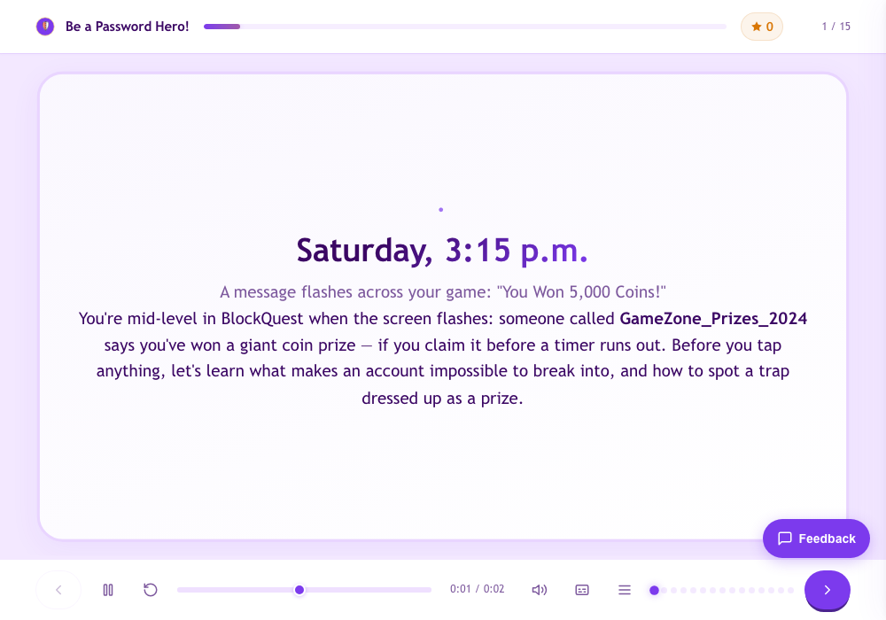
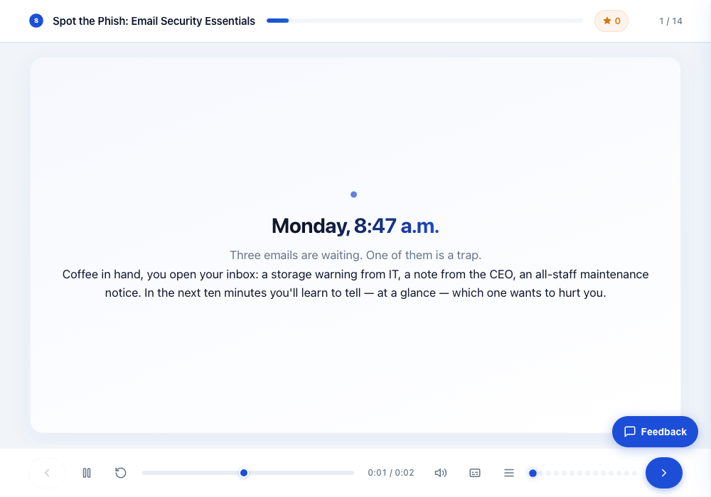
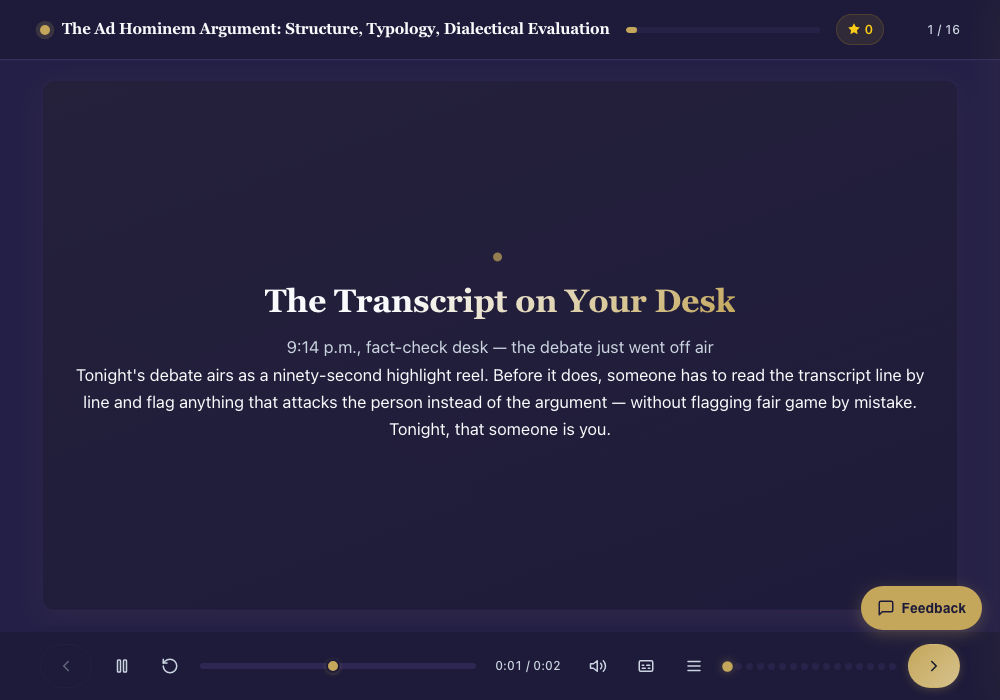

# edumints SCORM MCP

[](LICENSE)
[](https://github.com/kemalyy/edumints-scorm-mcp/releases)
[](pyproject.toml)
[](https://modelcontextprotocol.io)

## 在线演示

三门完整课程——三个级别，三种视觉风格——完全用本服务器构建，并通过一个在线部署提供。
**点击任意截图即可启动。**

| [Be a Password Hero!](https://scorm.edumints.com/demo/password-hero) | [Spot the Phish](https://scorm.edumints.com/demo/spot-the-phish) | [The Ad Hominem Argument](https://scorm.edumints.com/demo/ad-hominem) |
|:---:|:---:|:---:|
| [](https://scorm.edumints.com/demo/password-hero) | [](https://scorm.edumints.com/demo/spot-the-phish) | [](https://scorm.edumints.com/demo/ad-hominem) |
| 9–13 岁 · 网络安全 · `style-playful` + 定制品牌 | 企业新员工培训 · 邮件安全 · `style-minimal` + 企业品牌 | 研究生 · 论证理论 · `style-premium` |

每个演示都包含：叙事主线、逼真的仿真物件 SVG、找旗标模拟、前后对比、时间线、案例游戏与自适应
反馈——底层还有按题目粒度的 SCORM 报告。

> **一个用于组装交互式、符合 SCORM 标准的在线学习课程的 MCP 服务器。**
> 你（或像 Claude 这样的 AI 客户端）是**作者**；本服务器是**组装器**。
> 用结构化的规范描述课程——服务器负责校验、渲染并打包成可在任意 LMS（Moodle、SCORM Cloud……）
> 运行的**自包含 SCORM 压缩包**。

**🌐 语言：** [English](README.md) · [Türkçe](README.tr.md) · [Español](README.es.md) · [Русский](README.ru.md) · [简体中文](README.zh-CN.md) · [Azərbaycanca](README.az.md) · [Қазақша](README.kk.md) · [Кыргызча](README.ky.md)

开源，由 **[edumints.com](https://edumints.com)** 平台开发。设计为可**自托管**——在你自己的电脑或
服务器上运行——并**欢迎贡献**。

---

## 理念（一种不同的方式）

大多数在线课程都是用笨重的桌面工具手工搭建的。在这里，**由 AI 客户端描述课程**（目标、屏幕、测验、
分支、媒体），通过 [Model Context Protocol](https://modelcontextprotocol.io) 传递，服务器完成最难的
部分：校验、高级主题、无障碍 HTML 渲染、SCORM 运行时桥接与打包。最终得到符合标准的 SCORM 包，
无供应商锁定。

**作者 = MCP 客户端 · 组装器 = 本服务器。**


## 功能

- **28 种屏幕类型**——标题、内容、单选、判断、填空、拖放、热点、分支情景、手风琴、标签页、
  闪卡、配对、排序、时间线、lottie、**引导式软件模拟**、视频、总结、**决策情景**、**术语竞赛**、
  **逃生室**、**标注图表**、**数据图表**、**图像对比**、**结果明细**、**问卷 / 反思**、
  **可组合游戏**、**自适应练习**。
- **可组合游戏引擎**——**`game`** 屏幕由机制原语（分数/生命/计时器/提示）+ 声明式
  `when 事件 if 条件 then 动作` 规则 + 分支节点组合而成；**`adaptive_practice`** 屏幕评估能力
  （Elo 或 Bayesian Knowledge Tracing）以将难度校准到学习者。可选 **xAPI** 遥测（cmi5：部分支持 — 仅检测启动）、**反劣质质量门**
  （`lint_course`）以及游戏无障碍（WCAG 2.2.1）。全部确定性——服务器端无 LLM。参见
  `docs/GAME-ECD.md`、`docs/GAME-ADAPTIVE.md`。
- **幻灯片式舞台播放器**——固定 16:9 舞台，可缩放适配任意屏幕；播放栏（播放/进度/字幕/菜单/重播），
  以及与旁白同步的**时间线逐步显示**。按章节分组的目录菜单。舞台尺寸可调；完全响应式/移动端友好；
  内联 SVG 图标（无表情符号）。
- **逻辑与游戏化**——变量/状态、条件可见性、分支、积分与计时 HUD。
- **测评**——题目与目标对齐，对/错均有反馈，分数写入 SCORM。
- **媒体**——跨 MCP 引入（从你自己的 MCP 获取音频/图像/视频 → `add_asset`）、ffmpeg 处理、
  **程序化动态图形/数据可视化视频**（HyperFrames），以及内置**土耳其语 TTS**（Piper，离线）用于快速旁白。
- **主题与无障碍**——浅色/中性/高对比预设、品牌令牌、遵循 WCAG、尊重 `prefers-reduced-motion`。
- **SCORM 1.2 与 2004**、确定性打包、成本护栏、按需/惰性加载的重型功能（课程不使用则不加载）。

## 快速开始（自托管）

### Docker（推荐）
```bash
git clone https://github.com/kemalyy/edumints-scorm-mcp.git
cd edumints-scorm-mcp
docker build -t edumints-scorm-mcp .
docker run -p 8000:8000 -v "$PWD/data:/data" edumints-scorm-mcp
# MCP 端点: http://localhost:8000/mcp   ·   健康检查: http://localhost:8000/health
```
镜像已包含所有可选功能所需组件（ffmpeg、用于视频的 Node + HyperFrames、用于 TTS 的 Piper 与土耳其语语音）。

### 本地（Python）
```bash
python -m venv .venv && source .venv/bin/activate
pip install ".[tts]"          # ".[tts]" 添加离线土耳其语 TTS（Piper）；不需要可省略
python server.py              # 通过 HTTP 提供 MCP 服务
```
如需视频生成，还需安装 Node 22+ 与 HyperFrames（`npm i -g hyperframes`）以及 ffmpeg。

### 配置
复制 `.env.example` 并按需调整（数据目录、配额、基础 URL、TTL）。所有选项见该文件。本地运行无需任何密钥。

## 连接 AI 客户端

将任意 MCP 客户端指向 `http://<你的主机>:8000/mcp`：
- **Claude**（桌面/网页/Code）——添加为连接器 / MCP 服务器。
- **Antigravity** 及其他 MCP 客户端——相同端点（HTTP/Streamable）。

然后提问：*“制作一个 6 分钟、含测验和总结的 X 主题互动课程。”* 客户端会调用下列工具；你将得到可下载的
SCORM 压缩包。

> 与**创作技能（skill）**配套使用（一个 Claude Agent Skill，教 AI 客户端用本服务器创作高质量课程）：
> https://github.com/kemalyy/edumints-scorm-skill

## 核心工具（MCP）

| 工具 | 用途 |
|---|---|
| `build_from_spec` | 一份 JSON 规范 → 已校验项目 + 打包好的 SCORM 包（主路径） |
| `create_project` / `add_screen` / `update_screen` / … | 细粒度、增量编辑 |
| `set_theme` / `set_tracking` | 主题 + 完成/计分规则 |
| `add_asset` | 引入音频/图像/视频（data-URI 或 https，带 SSRF 防护） |
| `synthesize_speech` | 内置土耳其语旁白（Piper，离线）→ 音频资源 |
| `make_video_from_image_audio` / `render_motion_video` / `render_screen_video` | 视频（ffmpeg / HyperFrames） |
| `preview` / `validate_package` / `build_package` | 预览、校验、下载 SCORM 包 |

## 架构

```
MCP 客户端（作者）  ──►  scorm-mcp（组装器）
                          ├─ core/        模型（Pydantic）、打包、存储
                          ├─ components/  HTML 渲染器 + 运行时引擎 + 视频编译器
                          ├─ auth/        API 密钥 + OAuth、SSRF 防护
                          ├─ themes/      设计令牌 / 预设
                          ├─ runtime/     内置 SCORM 运行时（scorm-again，MIT）
                          └─ server.py    FastMCP 工具（HTTP）
```
输出：自包含的 `index.html` + `imsmanifest.xml` + 资源 + SCORM 运行时，打成 zip。

## 贡献

欢迎提交 Issue 和 PR。代码偏好小而专注的模块、增量式改动与向后兼容。参见 [CONTRIBUTING.md](CONTRIBUTING.md)。

## 测试

用 `pytest` 运行测试。

## 许可证

- 本项目：**MIT** — 见 [LICENSE](LICENSE)。
- 捆绑的第三方组件（scorm-again、lottie-web）：见 [THIRD_PARTY_NOTICES.md](THIRD_PARTY_NOTICES.md)。

由 **edumints.com** 开发。SCORM 是 ADL 的商标；提及的其他产品名称为各自所有者的商标（仅作指称性使用）。


<!-- synced: d398775 -->
